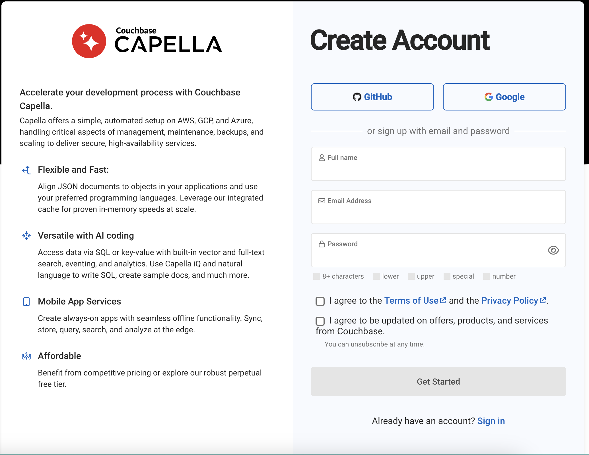
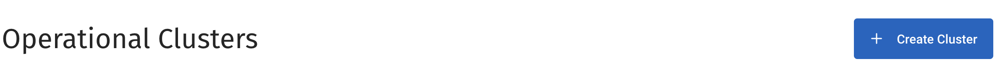
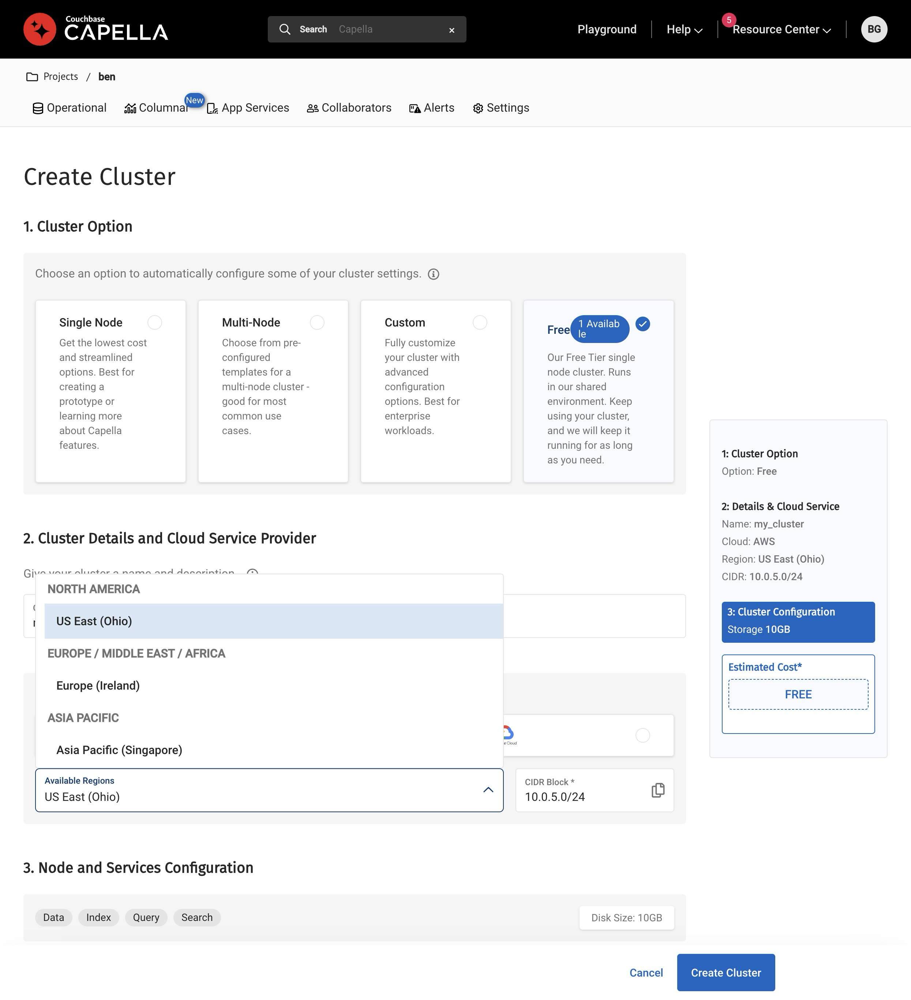

# Building-Privacy-Focused-Vector-Search-Applications: PyCon Workshop

This workshop is designed to help you get started with vector search using Couchbase and Python. We will be using the [Couchbase Python SDK](https://docs.couchbase.com/python-sdk/current/hello-world/start-using-sdk.html) and [Couchbase Capella](https://www.couchbase.com/products/cloud) managed database service.

The entire workshop can be run from inside a GitHub Codespace, which is a cloud-based development environment pre-configured with many necessary tools and services. You can also run it locally; we’ll use Python, the Couchbase Python SDK, and optionally Ollama for local embedding models.

> [!IMPORTANT]
> Key information needed for running this workshop in GitHub Codespaces can be found [here](#running-in-github-codespaces).

## Prerequisites

- A GitHub account
- A Couchbase Capella account
- Python 3.10+ and pip
- [Ollama Installed](https://ollama.com/download)

## Ollama Installation

This workshop is about building privacy‑focused vector search applications. Thus, we’ll use Ollama to run both the embedding model and the LLM entirely on your machine.

What we’ll install and why:

- embeddinggemma:latest — a fast local embedding model for turning text into vectors. We’ll use its embeddings for indexing and search.
- qwen3:8b — a capable local LLM for analysis, summarization, and Retrieval Augmented Generation steps we will incorporate alongside vector search.

### Install Ollama

- macOS (Homebrew):

```bash
brew install ollama
ollama --version
```

- Linux (official script):

```bash
curl -fsSL https://ollama.com/install.sh | sh
ollama --version
```

- Windows: Download and install from https://ollama.com/download, then verify in a new terminal:

```bash
ollama --version
```

Start the Ollama server (if it isn’t already running):

```bash
ollama serve
```

Tip: On Linux you can run it in the background with a process manager (systemd, tmux, or screen) if desired.

### Download the models

Pull the embedding model and the LLM locally. These are large downloads; ensure you have disk space and bandwidth.

```bash
# Embedding model (~600–700 MB range depending on platform)
ollama pull embeddinggemma:latest

# LLM (~5 GB)
ollama pull qwen3:8b
```

What they do:

- embeddinggemma:latest — Generates dense vector embeddings suitable for semantic similarity and retrieval. We’ll store these vectors in Couchbase and search with a vector index.
- qwen3:8b — General‑purpose LLM you can use for tasks like response synthesis, summarization, or query reformulation in a local/private workflow.

Verification:

```bash
ollama list
```

You should see entries similar to:

```
embeddinggemma:latest    85462619ee72    ~621 MB    just now
qwen3:8b                 500a1f067a9f     ~5.2 GB   just now
```

## Workshop Outline

1. [Create a Capella Account](#create-a-capella-account)
2. [Create a Couchbase Cluster](#create-a-couchbase-cluster)
3. [Create a Bucket](#create-a-bucket)
4. [Transform Data](#transform-data)
5. [Index Data](#index-data)
6. [Search Data](#search-data)
7. [Running in GitHub Codespaces](#running-in-github-codespaces)

## Create a Capella Account

Couchbase Capella is a fully managed database service that provides a seamless experience for developers to build modern applications. You can sign up for a free account at [https://cloud.couchbase.com/signup](https://cloud.couchbase.com/signup).



## Create a Couchbase Cluster

Once you have created an account, you can create a new Couchbase cluster by following the steps below:

1. Click on the "Create Cluster" button on the Capella dashboard.



2. Choose a cloud provider, name and region for your cluster and click on the "Create Cluster" button.




For Python, create and activate a virtual environment and install dependencies:

```bash
python -m venv .venv
source .venv/bin/activate
pip install couchbase==4.* python-dotenv requests openai
```

Other than that, Codespaces should have most base tooling in place for this workshop.
